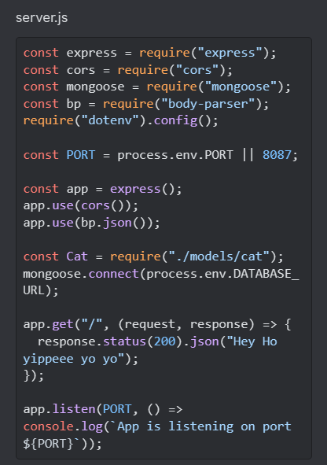
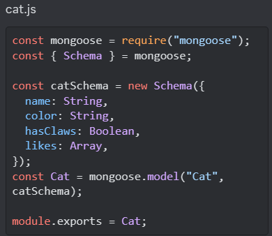
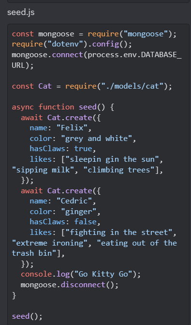

## MongoDB and Mongoose

### Reading  
[nosql vs sql](https://www.thegeekstuff.com/2014/01/sql-vs-nosql-db/?utm_source=tuicool)  

### Videos  
[sql vs nosql](https://www.youtube.com/watch?v=ZS_kXvOeQ5Y)  

### Bookmark and Review
[mongoose api](https://mongoosejs.com/docs/api/model.html#Model())  
[React Router](https://reactrouter.com/en/6.14.2/web/api/BrowserRouter) - not working  

### Questions and Answers
1. Fill in the chart below with five differences between SQL and NoSQL databases:

|      SQL       |     NoSQL     |
|:---------------|:--------------|
|                |               |
 	 
 	 
 	 
2. What kind of data is a good fit for an SQL database?
3. Give a real world example.
4. What kind of data is a good fit a NoSQL database?
Give a real world example.
5. Which type of database is best for hierarchical data storage?
6. Which type of database is best for scalability?
7. What does SQL stand for?
8. What is a relational database?
9. What type of structure does a relational database work with?
10. What is a ‘schema’?
11. What is a NoSQL database?
12. How does it work?
13. What is inside of a MongoDB database?
14. Which is more flexible - SQL or MongoDB? and why.
15. What is the disadvantage of a NoSQL database?  

### Morning class
**1. Step 1: Create a mono repo:**
- Open the terminal and navigate to the directory where you want to store the project.
    - mkdir coolcats
    - cd coolcats
    - mkdir server
    - ls to check server directory was created
    - npx create-react-app client
    - code . to open coolcats in VSCode
    - open the terminal inside VSCode
    - cd client
    - inside the client drectory run the following command:
        - rm -rf .git
    - cd ..
    - make sure you are inside the root directory coolcats and run the following command:
        - git init
    - cd server
        - make sure you are in the server directory and run the folling commands:
            - touch server.js
            - npm init -y
    - Check the package.json has the following
        - "main": "server.js"
        - "start": "node server.js"
    - Finally drag your .gitignore file from your client directory into the root directory.
    - delete the / from infront of /node_modules so it becomes node_modules
    - under # misc add .env to the list
    - cd into server and run the following command:
        - touch .env

**2. Step 2: Link your project to GitHub:**
- Log into github and create an empty new repository
    - (empty meaning no readme.md file, no gitignore file, no license)
    - Once the empty repo is created you are taken to a quick setup page
    - On the quick setup page:
        - scroll down to where it says …or push an existing repository from the command line.
            - select the first line and copy it.
            - inside VScode on the terminal make sure you are on the main branch on the root directory.
            - paste the line you copied from GitHub.
            - if you are on the master branch copy the second line from GitHub, if you are on the main branch miss skip this step.
            - git add .
            - git commit -m "initial commit"
            - git push -u origin main
        - On GitHub check your repository has been updated

**3. Step 3: Server and Client Initial settings:**
- Inside the terminal we need to install the packages that our application will need to work.
    - cd server
        - npm i express cors dotenv nodemon axios mongoose body-parser
    - Note (we may use all of these packages today, but you will throughout the week so I want you to have a comprehensive list of the packages we will need to run our full application)
    - check your package.json file and make sure your packages have all installed as dependencies.
    - Inside the package.json file change the start script to:
        - "start": "nodemon server.js"
    - Open a new terminal and run the following commands:
        - cd client
        - npm i axios dotenv

**4. Step 4: Set up an express server:**
- We have already installed our packages we need to make the application work.
    - inside server.js
        - const express = require("express")
        - const cors = require("cors")
        - const mongoose = require("mongoose")
        - const bp = require("body-parser")
        - require("dotenv").config()
        - const PORT = process.env.PORT || 8080
        - const app = express()
        - app.use(cors())
        - app.use(bp.json())
        - Create an endpoint to the root route
            - app.get("/", (request, response)=>{
response})  
        - app.listen`(PORT, ()=> console.log(App is listening on port ${PORT}))`  
        - Inside your .env file add:
            - PORT=8080
        - In the terminal make sure you are in the server directory and run the following command:
            - npm start
        - check localhost:8080 in the browser to make sure your are getting your response

**5. Step 5: MongoDB + Compass Setup**
- go to mongoDB and create an account
    - You will need to download and install compass
    - Once you have an account and have installed compass.
        - navigate to database deployments
        - In the top left corner underneath the Atlas logo click the folder tab
        - Click on the button + New Project
        - You will go to a create project page
            - name your project: coolcats
            - click next
        - you will now be on a page with the heading:
            - Add members and set permissions
            - leave blank and click the button Create Project
        - You will be back at the Database Deployments page
            - click the button Build a Database
        - You will be on a deploy your database page
            - Select the M0 free option
            - Select the aws provider
            - select Ireland as your region
            - set a name for your cluster coolcatscluster
            - click create
        - You will be on a security quickstart page
            - set a username for this project - I set bippy
            - set a password for this project - bippwd123
            - click Create User
            - Under where would you like to connect from select:
                - My Local Environment
                - inside the IP Address Input add:
                    - 0.0.0.0
                    - Click Add Entry
                - Click Finish and Close
                - You will get a congratulations modal pop up
                    - click Go to Database
            - You will be on the Database Deployments Page
                - In the drop down menu under the atlas logo in the top left corner the folder selected should be your project - coolcats

**6. Step 6**
- The main section on the page should be your cluseter - coolcatscluster
    - click the connect button
        - A modal will pop up - connect to coolcatscluster
            - under Access your data through tools select Compass
            - connecting with mongoDB compass
                - select I have MongoDB Compass installed
            - copy the connection string
            - Inside VSCode go to your .env file inside your server directory
            - add a new enviroment variable:
                - set the key to: DATABASE_URL
                - set the value to: the connection string you copied
                    - change the password in the string to the password you set for your cluster
                    - at the end of the connection string add a relative word after the .net
                    - save the .env file
                        - As the .env file has been changed you need to stop the server running in the terminal by entering the command c whilst holing down the control button - press control c in the terminal
    - Open mongoDB compass
        - under New Connection:
            - Paste the value of the DATABASE_URL into the url
                - click Save and Connect
            - Name the connection and give it a colour then click save and connect
        - This will take you to a new page where you will be at My Queries

**7. Step 7: Setting up the Schema**
- Inside VScode inside the Server directory
    - create a folder named models
        - inside the models folder create a file named cats.js
            - (the name of the file should be relevant to the objects you will be creating for your database)
        - The cat.js file is where we will set up our Schema
        - inside cat.js
            - set the mongoose package in a variable named mongoose
                - const mongoose = require("mongoose")
            - everything in mongoose is set using a Schema and we can deconstruct the Schema method from mongoose.
                - const {Schema} = mongoose
            - declare a variable and set the value to a new instance of Schema()
               - `const catSchema = new Schema({
                name: String,
                color: String,
                hasClaws: Boolean,
                likes: Array})`
            - Here we are setting a template for the objects that will be stored in our database. We can set the properties and datatypes within the object.
            - Create a model:
                - declare a variable and set the value to the model method on mongoose.
                    - A mongoose model takes two arguments
                        - the name you gave the variable that is creating the model
                        - the name of the Schema the database will model
                        - const Cat = mongoose.model("Cat", catSchema)
                    - export the model
                        - module.exports = Cat

**8. Step 8: Connect the server to the database and seed the database**  
- Inside the server.js file
    - make sure you are importing mongoose
        - const mongoose = require("mongoose")
        - import the model we set in cat.js that contains the Schema we built
            - const Cat = require("./models/cat")
        - connect the file to our database
            - mongoose.connect(process.env.DATABASE_URL)
    - Inside the server directory create a file named seed.js
        - we will use this to seed our database - add some data
    - inside the seed.js file:
        - first declare a variable to require the mongoose package
            - const mongoose = require("mongoose")
        - we need to access to the database url stored in our .env file
            - require("dotenv").config()
        - We then need to use the connect method on mongoose to to connect the file to the database.
            - mongoose.connect(process.env.DATABASE_URL)
        - We need access to our Schema
        const Cat = require("./models/cat")
        We need to create an asycronous function. This function will run the create method twice on the cat Schema created. The create method will be used to create the initial entries to our database. We also want notification that the data has been sent once the function has run so we set a console.log at the end of the function to notify us in the terminal. The last thing we want our function to do is diconnect from mongoose. To do this we invoke the disconnect method on mongoose.
- `async function seed(){
      await Cat.create({
      name: "Felix",
      color: "grey and white",
      hasClaws: true,
      likes: ["sleeping in the sun", "sipping milk", "climbing trees"]});
      await Cat.create({
      name: "Cedric",
      color: "ginger",
      hasClaws: false,
      likes: ["figthing in the street", "extreme ironing", "eating out of garbage bins"]})
      console.log("Go Kitty Go")
      mongoose.disconnect()}`
    - The last thing we want to do in the file is invoke the seed funtion.
        - seed()
        - To seed the database run the following command in the terminal:
            - cd server
            - node seed
        - Go to mongoDB Compass refersh the connection:
            - top left corner click on the 3 dots
            - click refresh
                the new data should be in the database.

### Elisa's Input:
1. Importing plugins we need  
    const express = require("express");  
    const cors = require("cors");  
    const mongoose = require("mongoose");  
    const bp = require("body-parser");  
    const bodyParser = require("body-parser");  
    require("dotenv").config();  

2. grabs the port from .env - if fails, use 8094 as a default port  
    const PORT = process.env.PORT || 8094;  

3. creates an express instance called app, tells it to use cors and body parser  
    const app = express();  
    app.use(cors);  
    app.use(bp.json());  

4. imports cat from cat.js  
    const Cat = require("./modules/cat");  

5. tells the mongoose plugin to use your database  
        mongoose.connect(process.env.DATABASE_URL);  

6. tells the server what to do when it's interacted with:  
`   app.get("/", (request, response)=>{
        response.status(200).json("Around the world Around the world");
    })`  

7. tells you the express instance is running on your terminal  
   `app.listen(PORT, ()=> console.log(\App is listening on port: ${PORT}`))`

  

  

  

